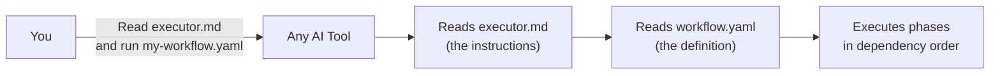
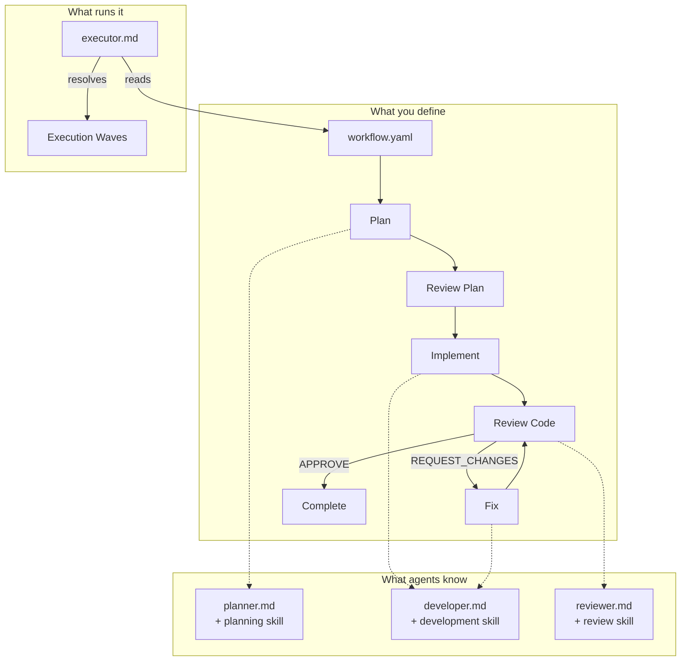

<p align="center">
<br>

</p>

<p align="center">
  <strong>Vendor-agnostic multi-agent workflow orchestration.</strong><br>
  Define the workflow. Run it in whatever tool you already use.
</p>

<p align="center">
  <a href="https://github.com/paoloregoli/orkestro/blob/main/LICENSE"></a>
  <a href="#"></a>
  <a href="#"></a>
  <a href="#"></a>
</p>

---

> **Orkestro doesn't call LLMs.** It doesn't manage API keys, models, or providers.
> It's a **prompt sequencer and context orchestrator** that sits above your coding agent.
> You define *what* needs to happen. Your tool handles *how*.

---

## The Problem

Every AI workflow tool today locks you in:

- Your workflows are tied to **one vendor** — switch tools and you start over
- Your team can't **share workflows** if they use different AI assistants
- Your orchestration logic is scattered across **proprietary formats**
- Skills and agents you build are **not portable**

## The Solution

**Two files. No install. No dependencies.**

Copy `executor.md` and a workflow YAML into your repo. Tell your AI tool to read them. Done.



Works with **Claude Code** · **GitHub Copilot** · **Cursor** · **Windsurf** · **Aider** — anything that can read files and follow instructions.

---

## Principles

| # | Principle | What it means |
|---|---|---|
| 1 | **Vendor-agnostic** | No coupling to any AI provider, model, or tool. Same workflow runs everywhere. |
| 2 | **YAML is the product** | Declarative, version-controlled, diffable, reviewable in PRs, shareable across teams. |
| 3 | **Single responsibility** | Workflow orchestrates. Skills contain knowledge. Agents define roles. Each piece does one job. |
| 4 | **Your tool is the runtime** | Orkestro doesn't call LLMs. Your AI tool reads the executor and follows it. |
| 5 | **Skills are universal** | Markdown knowledge files. Portable by nature — they're text, not code. |
| 6 | **Context is explicit** | Every phase declares what data it receives and from where. No implicit state. |
| 7 | **Gates are first-class** | Human approval and agent verdicts are built in, not bolted on. |
| 8 | **Fail safely** | Retry limits, escalation paths, and safety guards — defined upfront. |

---

## Quick Start

<details open>
<summary><strong>1. Create the folder</strong></summary>

```bash
mkdir .orkestro
```

</details>

<details open>
<summary><strong>2. Copy the files</strong></summary>

Copy from this repo into your project:

```
.orkestro/
├── executor.md              # How to run workflows
└── my-workflow.yaml         # Your workflow (from workflow-template.yaml)

agents/                      # Agent definitions
├── planner.md
├── developer.md
└── reviewer.md

skills/                      # Knowledge files
├── planning.md
├── development.md
└── review.md
```

</details>

<details open>
<summary><strong>3. Define your workflow</strong></summary>

Edit `.orkestro/my-workflow.yaml`:

```yaml
name: my-workflow
version: "1.0.0"

input:
  - name: requirement
    type: string
    required: true

phases:
  plan:
    agent: planner
    prompt: |
      {{ input.requirement }}

  review_plan:
    depends_on: [plan]
    gate:
      type: human_approval
      actions:
        approve: proceed
        reject: stop

  implement:
    agent: developer
    depends_on: [review_plan]
    context:
      from_phase: plan
    retry:
      max: 2
      on: failure

  review_code:
    agent: reviewer
    depends_on: [implement]
    context:
      from_phase: implement
    gate:
      type: agent_verdict
      field: verdict
      actions:
        APPROVE: proceed
        REQUEST_CHANGES: goto:implement
```

</details>

<details open>
<summary><strong>4. Run it</strong></summary>

Tell your AI tool:

> **Read `.orkestro/executor.md` and execute `.orkestro/my-workflow.yaml` with requirement: "your requirement here"**

That's it. No install. No build step. No config.

</details>

---

## How It Works



### The Three Layers

| Layer | Responsibility | Format | Lives in |
|---|---|---|---|
| **Workflow** | Who does what, in what order, with what data | YAML | `.orkestro/` |
| **Agents** | Role definitions — output contracts and rules | Markdown | `agents/` |
| **Skills** | Domain knowledge — patterns, conventions, checklists | Markdown | `skills/` |

The **executor** ties them together. It reads the workflow, loads agents and skills, resolves the phase graph, and drives execution through your AI tool.

---

## Concepts

<details>
<summary><strong>Phases & Waves</strong> — per-phase parallelism</summary>

Phases form a directed acyclic graph via `depends_on`. The executor groups them into waves. Within a wave, you control which phases run concurrently:

```yaml
phases:
  plan:
    agent: planner
    prompt: "{{ input.requirement }}"

  implement_api:
    agent: developer
    depends_on: [plan]
    parallel: true                    # Runs concurrently with implement_db

  implement_db:
    agent: developer
    depends_on: [plan]
    parallel: true                    # Runs concurrently with implement_api

  integration_test:
    depends_on: [implement_api, implement_db]
```

```
Wave 1:  [plan]                         ← sequential
              |
Wave 2:  [implement_api, implement_db]   ← concurrent (both parallel: true)
              |
Wave 3:  [integration_test]             ← sequential
```

- `parallel: false` (default) — phase runs alone, one at a time
- `parallel: true` — phase runs concurrently with other parallel phases in the same wave
- If the AI tool doesn't support concurrency, parallel phases fall back to sequential — always safe

</details>

<details>
<summary><strong>Gates</strong> — pause and wait for decisions</summary>

**Human approval** — the user decides:
```yaml
gate:
  type: human_approval
  actions:
    approve: proceed
    reject: stop
    request_changes: goto:plan
```

**Agent verdict** — the agent's output decides:
```yaml
gate:
  type: agent_verdict
  field: verdict
  actions:
    APPROVE: proceed
    REQUEST_CHANGES: goto:fix
```

</details>

<details>
<summary><strong>Context & Compaction</strong> — data flows between phases</summary>

| Strategy | Behaviour |
|---|---|
| `none` | Pass raw output as-is |
| `summary` | Summarise into 5-10 bullet points |
| `structured` | Extract decisions, files changed, open questions |
| `custom` | Use your own compaction prompt |

```yaml
review:
  context:
    from_phase: implement
    compaction: structured
```

</details>

<details>
<summary><strong>Retries & Escalation</strong> — handle failures gracefully</summary>

```yaml
implement:
  retry:
    max: 2
    on: failure
    on_exceeded: goto:escalation
```

</details>

<details>
<summary><strong>Safety</strong> — global constraints</summary>

```yaml
safety:
  blocked_commands:
    - "rm -rf"
    - "git push --force"
  blocked_files:
    - ".env"
    - "credentials.json"
```

</details>

<details>
<summary><strong>Variables</strong> — template interpolation</summary>

| Variable | Resolves to |
|---|---|
| `{{ input.<name> }}` | Workflow input parameter |
| `{{ phases.<name>.output }}` | Output from a completed phase |

</details>

---

## Starter Agents & Skills

Orkestro ships with 3 ready-to-use agents and their skills. Copy them into your repo and start immediately.

### Agents

| Agent | Role | Output Contract | Skill |
|---|---|---|---|
| [`planner`](agents/planner.md) | Creates sequenced implementation plans | `<plan-output>` | [`planning.md`](skills/planning.md) |
| [`developer`](agents/developer.md) | Implements code, runs builds and tests | `<dev-output>` | [`development.md`](skills/development.md) |
| [`reviewer`](agents/reviewer.md) | Reviews diffs for correctness and coverage | `<review-output>` | [`review.md`](skills/review.md) |

### Extending with Domain Skills

The starter skills are generic. For real projects, create domain-specific skills:

```
skills/
├── planning.md              # Starter (generic)
├── development.md           # Starter (generic)
├── review.md                # Starter (generic)
├── dotnet-cqrs.md           # Your team's .NET CQRS patterns
├── react-components.md      # Your team's React conventions
└── terraform-modules.md     # Your team's IaC standards
```

Agents reference skills. Swap skills without changing agents. Reuse agents across projects.

See [agents/README.md](agents/README.md) and [skills/README.md](skills/README.md) for guides on creating your own.

---

## Multiple Workflows

One repo can have multiple workflows side by side:

```
.orkestro/
├── executor.md
├── feature-development.yaml
├── bug-fix.yaml
├── code-review-only.yaml
└── incident-response.yaml
```

Run any one:

> Read `.orkestro/executor.md` and execute `.orkestro/bug-fix.yaml` with requirement: "..."

---

## Examples

| Workflow | Phases | Features |
|---|---|---|
| [`hello-world.yaml`](examples/hello-world.yaml) | 2 | Minimal — generate + human review |
| [`plan-implement-review.yaml`](examples/plan-implement-review.yaml) | 5 | Full cycle — plan, approve, implement, review, fix loop |

---

## Repository Structure

```
orkestro/
├── executor.md                     # Core — how to run any workflow
├── workflow-template.yaml          # Starting template — copy and customise
├── CONTRIBUTING.md                 # How to contribute
│
├── agents/                         # Starter agent definitions
│   ├── planner.md
│   ├── developer.md
│   ├── reviewer.md
│   └── README.md                   # Guide: creating agents
│
├── skills/                         # Starter knowledge files
│   ├── planning.md
│   ├── development.md
│   ├── review.md
│   └── README.md                   # Guide: creating skills
│
├── examples/                       # Example workflows
│   ├── hello-world.yaml
│   └── plan-implement-review.yaml
│
└── docs/
    └── schema-spec.md              # Full YAML schema reference (v0.2)
```

---

## Who Is This For?

| You are... | Orkestro gives you... |
|---|---|
| A **team using multiple AI tools** | One workflow format that works in Claude Code, Copilot, Cursor — no rewrites when you switch |
| An **organisation standardising AI workflows** | A shareable, version-controlled format that works across departments |
| A **developer who wants control** | Declarative YAML over black-box orchestration. You see every phase, gate, and retry. |
| **Tired of vendor lock-in** | Switch tools freely. Your workflows, agents, and skills are portable. |

---

## Schema Reference

See [docs/schema-spec.md](docs/schema-spec.md) for the complete field reference — every YAML field documented with types, defaults, and examples.

---

## Contributing

See [CONTRIBUTING.md](CONTRIBUTING.md). PRs welcome — especially new example workflows and starter skills.

---

<p align="center">
  <strong>Define the workflow. Run it anywhere.</strong>
</p>
